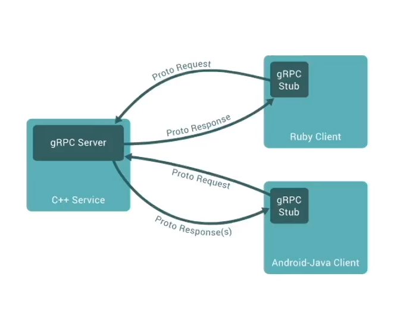
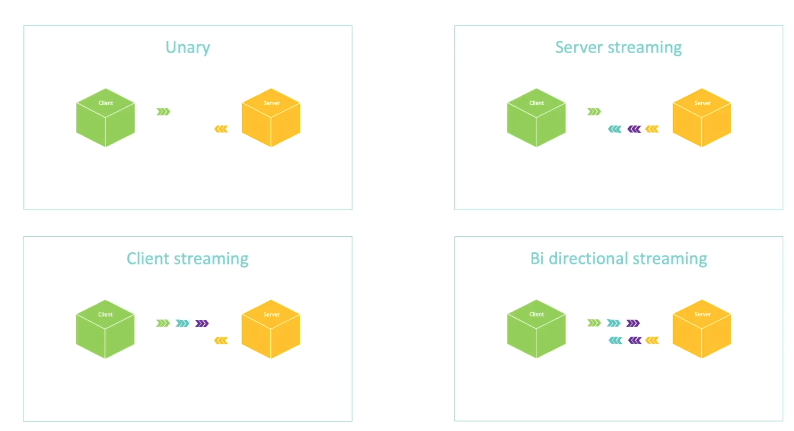

# gRPC [Golang] Master Class: Build Modern API & Microservices

Wed Jun 15, 2022
[course-link](https://www.udemy.com/course/grpc-golang/)

## Microservices

Microservices are everywhere in modern tech. There are lots of things microservices need to agree on in the modern day in order to function properly, such as:

- API to exchange data
  - GET /api/v1/user/123/post/456
  - POST /api/v1/user/123/post
  - etc...
- Data format
  - XML
  - JSON
  - Binary
- Error patterns
  - Behaviors (Which verb do you use? GET? POST?)
  - Error Codes
- Load Balancing
  - Payload size
  - Scalability
  - Language Interop
  - Auth, Monitoring, Log, etc... etc... etc...
- Many other things... This can be overwhelming D:

> Question: Don't you wish you could just focus on the data and leave the rest to the framework? This is where `gRPC` comes from.

`gRPC` is a fast, modern, efficient framework build on top of `HTTP2`. It has low latency, and support streaming of data. It is language independant, and makes it easy to implement authentication, logging, and monitoring, for example.



An `RPC` is an abbreviation for `remote processor core`, when you code, it will look like you are coding a function directly on a server.

### Three steps to getting started

- Choose a supported language
- Generate the code (Protobuff)
- have fun!

### Sneak Peak!

```proto
syntax = "proto3";

message Greeting {
  string first_name = 1;
}

message GreetRequest {
  Greeting greeting = 1;
}

message GreetResponse {
  string result = 1;
}

service GreetService {
  rpc Greet(GreetRequest) returns (GreetResponse) {}
}
```

### Why `ProtoBuff`?

- language agnostic
- small payload
- Easy API evolution

You should be familiar with Protobuff before starting this course!

Protobuff stands for `Protocol Buffer`

## HTTP1 vs HTTP2

Today, most of the web today is composed of HTTP1.

- HTTP1 opens a TCP connection _per_ request.
- HTTP1 does not compress headers.
- HTTP1 only accepts the `Request / Response` pattern.

On the other hand... HTTP2:

- provides one long lasting connection that can be shared by multiple requests/responses.
- server push. server can simply push data when it's ready, without the client asking for it.
- Multiplexing: meaning server can client can push multiple messages between each other using the same TCP connection.
- Headers compressed to binary data.
- More secure bc requires SSL connection.

## Types of API in gRPC



### Unary

The closest resembelence to REST API. The client will send one request, and server will send one response. If we are utilizing a tradital

### Server Streaming

The client will send one request, and the server can send one **or more** responses.

### Client Streaming

The client sends one **or more** requests, and the server sends only one response.

### Bi directional streaming

Combo of server streaming & client streaming.

```proto
service GreetService {
  // Unary
  rpc Greet(GreetRequest) returns (GreetResponse) {};

  // Server Streaming
  rpc GreetManyTimes(GreetRequest) returns (stream GreetResponse) {};

  // Client Streaming
  rpc LongGreet(stream GreetRequest) returns (GreetResponse) {};

  // Bi directional streaming
  rpc GreetEveryone(stream GreetRequest) returns (stream GreetResponse) {};
}
```

## Security in gRPC

- Schema based serialization
- Easy SSL certificates initialization
- Interceptors for Auth